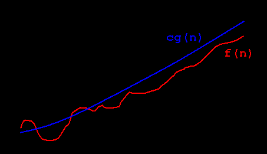

# Lecture 7 & 8: Predicates & Quantifiers

### Predicates
- A predicate is a function that maps a given set to a codomain
    - a predicate is a proposition with a hole to fill
  - Usually, a predicate describes a property that domain elements may or may not have.
    - specifiying a subset of a range of domain
  - Defining a predicate
    - specify its domain and its value at each domain element
    - specify the rule assigning truth values to domains elements can be specified using a formula/English description
      - finite domains needs finite rule, infinite domain needs resursively defined rule

### Truth Set
- the truth set of a predicate is a the collection of all elements in its domain where the predicate evaluates to T.

### Terms
|term|def.|
|---|---|
|universal quantification| All of the domain of the predicate is equal to $x$  written as: $\forall x\ P(x)$ or $\forall x\in U\ P(x)$ as statement:"$P(x)$ for all values of $x$ in the domain $U$" &nbsp;|
|existential quantification| any one element equals to x  written as: $\exists x\ P(x)$ or $\exists x\in U\ P(x)$ as statement: There exists an element $x$ in the domain $U$ such that $P(x)$ &nbsp;|
|counterexample| an element of which $P(X) = F$ within/of $\forall x\ P(x)$ &nbsp;|
|witness| an element of which $P(X) = T$ within/of $\exists x\ P(x)$ &nbsp;|
|logically equivalent| predicates and quantifiers that have the same truth value no matter which predicates (domains and functions) are substituted in &nbsp;|

### Quantifiers
- **Quantifier version of DeMorgan's laws:**
  - $\lnot\forall xP(x)\ \equiv\ \exists x(\lnot P(x))$
  - $\lnot\exists xQ(x)\ \equiv\ \forall x(\lnot Q(x))$

### Asymptotic Analysis (Big O)
