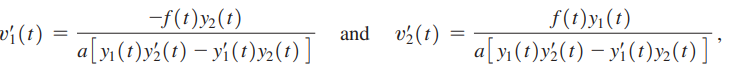

# Chapter 4 (2): More Linear Second Order Differential Equations

### 4.5 The Superposition Principle and Undetermined Coefficients Revisited
- $ay''+by'+cy=P_m(t)e^{rt}$
  - Partial Solution: $y_p(t)=t^s(A_kt^k+\cdots+A_1t+A_0)e^{r t}$
    - Not Root: $s=0$
    - Single Root: $s=1$
    - Double Root: $s=2$
- $ay''+by'+cy=P_m(t)e^{\alpha t}\cos\beta t+Q(t)e^{\alpha t}\sin\beta t,\quad\ \beta\neq 0$
  - Partial Solution: $y_p(t)=t^s(A_kt^k+\cdots+A_1t+A_0)e^{\alpha t}\cos\beta t$  $\quad\quad\quad\quad\quad\quad\quad\quad\quad\quad+ t^2(B_kt^k+\cdots +B_1t+B_0)e^{\alpha t}\sin\beta t$
    - Not Root: $s=0$
    - Is Root: $s=1$

 

### 4.6 Variation of Parameters 
- $ay''+by'+cy=f(t)$
  - $y_h(t)=c_1y_1(t)+c_2y_2(t)$
  - $y_p(t)=v_1y_1+v_2y_2$
    - derive $y_p$ and plug it into original solution, and solve for $v_1$ and $v_2$
- Shortcut

- General Solution
  - $y(t)=y_h(t)+y_p(t)$

 

### 4.7 Variable-Coefficient Equations
- Cauchy-Euler Eq.
  - $at^2y''(t)+bty'(t)+cy=f(t)$
  - $y''+\cfrac{b}{at}y'+\cfrac{c}{at^2}y=\cfrac{f(t)}{at^2}$
    - associated *characteristic equation*: $ar^2+(b-a)r+c=0$
  - General Solution Forms
    - Single Roots: $y(t)=c_1t^{r_1}+c_2t^{r_2}$
    - Double Roots: $y(t)=c_1t^r+c_2t^r\ln t$
    - Complex Roots: $y(t)=c_1t^{\alpha}\cos(\beta\ln t)+c_1t^{\alpha}\sin(\beta\ln t)$
- Variation of Parameters needs to be applied to Cauchy-Euler Eq.s
- Reduction of Order
  - $y_2(t)=y_1(t)\int\cfrac{e^{-\int p(t)dt}}{y_1(t)^2}$
  - $y_2(t)=y_1(t)\cdot v(t)$