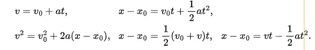

# Measurement | 1D Motion | Vectors

#### International System of Units
|Quantity|Unit Name|Unit Symbol|
|---|---|---|
|Length| meter| m|
|Time| second| s|
|Mass|kilogram| kg|

- SI derived units are defined in terms of these base units (ex. SI unit for power -> watt)
$$ 1 \text{watt} = 1\text{kg}\cdot m^2/s^3$$

#### Prefixes for SI Units
|Factor|Prefix|Symbol|  ||||
|---|---|---|        ---|---|---|---|
|$10^{24}$|yotta-|Y|    |$10^{-1}$ |deci-  |d       |
|$10^{21}$|zetta-|Z|    |$10^{-2}$ |centi- |c       |
|$10^{18}$|exa-  |E|    |$10^{-3}$ |milli- |m       |
|$10^{15}$|peta- |P|    |$10^{-6}$ |micro- |$\mu$   |
|$10^{12}$|tera- |T|    |$10^{-9}$ |nano-  |n       |
|$10^9$ |giga- |G|      |$10^{-12}$|pico-  |p       |
|$10^6$ |mega- |M|      |$10^{-15}$|femto- |f       |
|$10^3$ |kilo- |k|      |$10^{-18}$|atto-  |a       |
|$10^2$ |hecto-|h|      |$10^{-21}$|zepto- |z       |
|$10^1$ |deka- |da|     |$10^{-24}$|yocto- |y       |

#### Displacement $\Delta x$
- displacement is a vector quantity, can be + or -
$$
\Delta x =x_2 - x_1
$$

#### Avg Velocity
- Average volocity does not depend on distance, but only displacement or start and end position
$$
v_{\text{avg}}=\cfrac{\Delta x}{\Delta t}=\cfrac{x_2-x_1}{t_2-t_1}
$$

#### Avg Speed
$$
s_{\text{avg}}=\cfrac{\text{total distance}}{\Delta t}
$$

#### Accerleration
$$
a_{\text{avg}}=\cfrac{\Delta v}{\Delta t} \quad\quad a=\cfrac{dv}{dt}=\cfrac{d^2x}{dt^2}
$$
Constant Accerlation

#### Vector Basics
$$
a_x = a\ \cos(\theta) \quad\quad a_y=a\ \text{sin}(\theta)
$$
