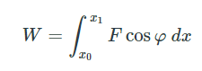
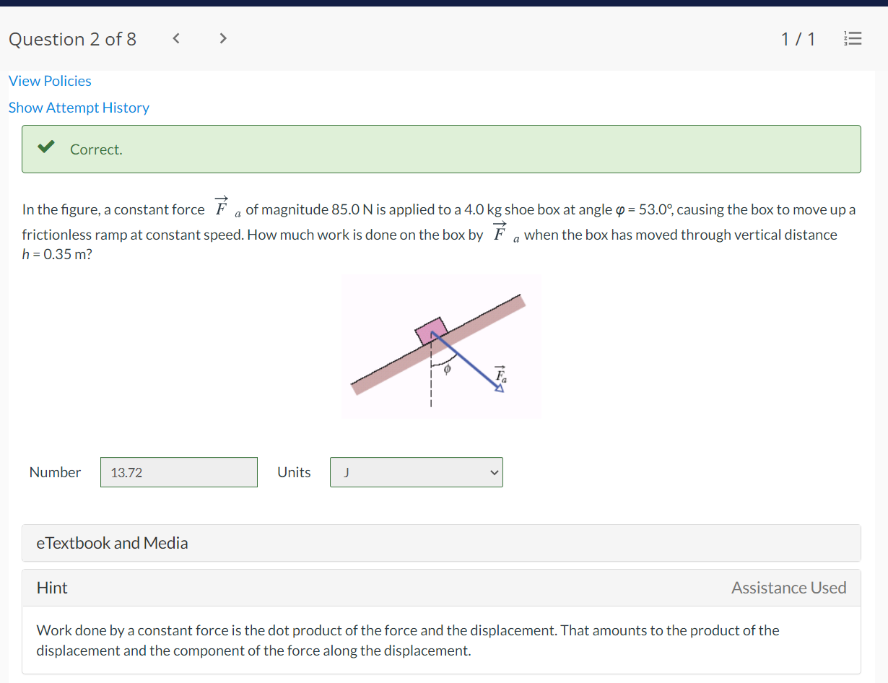

# Chapter 7: Kinetic Energy and Work

### Equations
|type|eq.|
|---|---|
|Kinetic Energy| $K=1/2mv^2$ &nbsp;|
|unit joule| $1\text{ joule}= 1\text{J} = 1\text{kg}\cdot m^2/s^2$ &nbsp;|
|Work & KE | $W=Fd\cos\phi=\overrightarrow{F}\cdot\overrightarrow{d}$  $W=\Delta K=K_f-Ki$ $\quad\ \ =\frac{1}{2}mv^2-\frac{1}{2}mv_0^2$ $\quad\ \ =F_xd$ &nbsp;|
|Work by $F_spring$| $F_x=-kx$ ... &nbsp;|

 

### Kenetic Energy
- Energy is a scalar quntity associated with the state of one or more objects
- Kinetic Energy -> state of motion of an object
  - $K=1/2mv^2$ 
  - (unit: $1\text{joule}= 1\text{J} = 1\text{kg}\cdot m^2/s^2$)

 

### Work
- Work is energy transferred to or from an object via a force acting on the object (can be +/-)
- Only the component of $\overrightarrow{F}$ along $\overrightarrow{d}$ can do work on the object
- $W=Fd\cos\phi=\overrightarrow{F}\cdot\overrightarrow{d}$
  - $\phi$ is the constant angle between $\overrightarrow{F}$ and $\overrightarrow{d}$
- $W=\Delta K=K_f-Ki$ &nbsp;&nbsp;&nbsp;&nbsp;*work-kinetic energy theorem*
- 

 

### Significant digits
"When multiplying and dividing numbers, the number of significant figures used is determined by the original number with the smallest amount of significant figures. When adding and subtracting, the final number should be rounded to the decimal point of the least precise number."

Souce: [lumen learning](https://courses.lumenlearning.com/introchem/chapter/significant-figures/#:~:text=When%20multiplying%20and%20dividing%20numbers,of%20the%20least%20precise%20number.)

### Power
[Power Problem need to figure out](https://www.toppr.com/ask/question/an-initially-stationary-20-kg-object-accelerates-horizontally-anduniformly-to-a-speed-of-10-ms/)

### Why, I don't understand
